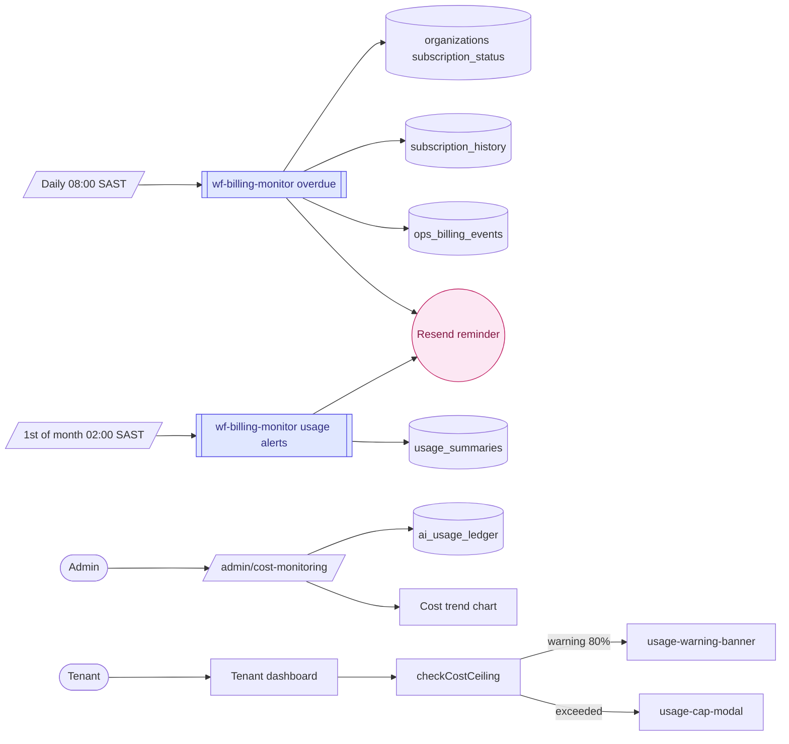

# Analytics

> Usage, billing, and AI cost monitoring — cross-module metrics for platform admins and per-tenant usage tracking.

---

## Quick view

---

## What it does (in 30 seconds)

Analytics in DraggonnB OS is primarily a platform operations layer rather than a standalone business intelligence product. It covers three areas: billing monitoring (overdue subscriptions, usage alerts), AI cost tracking (per-org, per-agent spend from `ai_usage_ledger`), and a dedicated admin cost monitoring dashboard. Per-module analytics (email open rates, accommodation occupancy) live within those modules, not here.

---

## Built capabilities

| Capability | Type | What it does | Trigger / cadence |
|---|---|---|---|
| Billing monitor — overdue detection | N8N Workflow | Daily check for `organizations.subscription_status = active` with `next_billing_date < today`; checks `subscription_history` for recent payment; marks `payment_failed`; sends Resend reminder email; logs to `ops_billing_events` | Daily 06:00 UTC (08:00 SAST) |
| Billing monitor — monthly usage alerts | N8N Workflow | 1st of each month: calls `aggregate_monthly_usage()` RPC; fetches `usage_summaries` for orgs at ≥80% of any metric limit; sends usage alert email via Resend | 1st of month 02:00 SAST |
| Admin cost monitoring dashboard | UI | `/admin/cost-monitoring` — trend chart and cost table of `ai_usage_ledger` data; shows cross-org AI spend | Admin on-demand |
| Cost trend chart | UI Component | `_components/cost-trend-chart.tsx` — visualises AI spend over time | On admin page render |
| Cost table | UI Component | `_components/cost-table.tsx` — per-org, per-agent breakdown | On admin page render |
| Usage warning banner | UI | `_components/usage-warning-banner.tsx` — shown on tenant dashboard when approaching cost ceiling | On dashboard render |
| Usage cap modal | UI | `_components/usage-cap-modal.tsx` — blocks further AI actions when cost ceiling is exceeded | On agent call rejection |
| N8N analytics workflow | N8N Workflow | `wf-analytics.json` — general analytics workflow; processes platform-level metrics | Webhook / cron |
| Accommodation occupancy snapshot | N8N Workflow | `wf-accom-occupancy-snapshot.json` — captures daily occupancy metrics per property | Nightly cron |
| CRM engagement score | N8N Workflow | Nightly scoring of contacts and deals into `crm_action_suggestions` (see CRM module) | Nightly 02:00 SAST |

---

## AI Agents (if any)

No AI agents in the Analytics module. Cost monitoring data comes from querying `ai_usage_ledger` directly. The billing monitor workflow does not call any AI.

---

## N8N workflows

| Workflow file | Purpose | Schedule | Status |
|---|---|---|---|
| `wf-billing-monitor.json` | Overdue subscription detection + payment reminder emails + monthly usage alerts | Daily 08:00 SAST (overdue check); 1st of month 02:00 SAST (usage alerts) | active |
| `wf-analytics.json` | General platform analytics processing | Webhook / cron | active |
| `wf-accom-occupancy-snapshot.json` | Daily accommodation occupancy capture | Nightly cron | active (accommodation-specific) |

---

## Database (key tables)

- `ai_usage_ledger`: every AI agent call logged (organization_id, agent_type, model, tokens, cost_zar_cents, error, recorded_at)
- `agent_sessions`: per-session AI cost accumulation (cost_zar_cents, tokens columns added in migration 25)
- `usage_summaries`: monthly aggregated usage per org per metric (populated by `aggregate_monthly_usage()` RPC)
- `ops_billing_events`: billing event log (event_type, client_id, organization_name, plan_id, metadata)
- `subscription_history`: payment history for subscription reconciliation

---

## User flows (the 3 most common)

1. **Admin cost review:** Platform admin goes to `/admin/cost-monitoring` → sees trend chart of AI spend across all orgs → cost table shows per-org, per-agent breakdown from `ai_usage_ledger`. Identifies an org with unusually high Sonnet spend → investigates their agent sessions.

2. **Billing overdue flow:** `wf-billing-monitor.json` fires daily → finds org with `next_billing_date < today` → checks `subscription_history` for recent payment → none found → marks org `subscription_status = payment_failed` → sends Resend email to org email address → logs to `ops_billing_events`.

3. **Usage cap warning for tenant:** Tenant org is at 85% of their AI cost ceiling → BaseAgent's `checkCostCeiling()` returns a warning flag on next call → dashboard renders `usage-warning-banner.tsx` ("You're approaching your AI usage limit"). At 100%, next agent call is blocked and `usage-cap-modal.tsx` is shown.

---

## Integrations

- **External:** Resend (billing reminder emails and usage alert emails from `wf-billing-monitor.json`)
- **Internal:** `ai_usage_ledger` is the shared ledger populated by all modules; analytics reads it cross-module

---

## Tier gating

Admin cost monitoring (`/admin/cost-monitoring`) is restricted to `platform_admin` role. Per-tenant usage banners and modals are shown to all authenticated users of an org when their ceiling is approached.

---

## What's NOT in this module yet

- Per-tenant business analytics dashboard (revenue trends, booking volumes, contact growth — these are rendered within each module, not in a unified analytics view)
- Exportable reports (CSV/PDF of usage or billing data)
- Real-time streaming analytics
- Google Analytics or Mixpanel integration for product usage tracking
- Accommodation-specific revenue analytics (occupancy and revenue reports live in the accommodation module's own pages)

---

## Cross-module ties

- Analytics is the consumer of data produced by every other module — `ai_usage_ledger` comes from all AI-using modules; `usage_summaries` aggregates from platform-wide metrics
- Billing monitor affects all client orgs regardless of which modules they use

---

*Source of truth (last verified): 2026-04-27*
*Module registry: analytics, min_tier = starter (basic); advanced analytics planned for growth/scale tiers*
*Phase 11 build status: partial — admin cost monitoring and billing monitor are built; unified per-tenant business analytics dashboard is not yet built*
