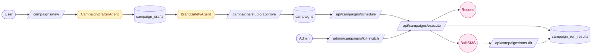

# Campaign Studio

> AI-drafted multi-channel campaigns with brand safety review and admin kill switch — email and SMS live today, social channels wired and ready for Meta credentials.

---

## Quick view

---

## What it does (in 30 seconds)

Campaign Studio lets a user describe a campaign intent ("promote our Sunday brunch special"), then generates complete multi-channel copy: 5 social posts (Facebook, Instagram, LinkedIn), 1 email (with HTML), and 1 SMS — all written in the tenant's brand voice. Every draft gets a brand safety check before scheduling. An admin kill switch can halt all pending/executing campaign runs for any org in one action.

---

## Built capabilities

| Capability | Type | What it does | Trigger / cadence |
|---|---|---|---|
| CampaignDrafterAgent | AI Agent | Generates 5 social posts + 1 email + 1 SMS as structured JSON using tenant brand voice; runs on Haiku (upgraded to Sonnet if tier allows) | User clicks "Generate drafts" in studio |
| BrandSafetyAgent | AI Agent | Haiku-based safety reviewer; checks draft against SA-specific sensitivity rules + brand voice forbidden topics; returns {safe, flags[], recommendation} | User clicks "Check safety" or auto-run before approve |
| Brand safety budget enforcement | DB Process | Hard limit of 20 safety checks/day/tenant; beyond limit, user sees banner "proceed at your own discretion" — publish NOT hard-blocked | Per check call |
| Campaign approve flow | API Route | `POST /api/campaigns/[id]/approve` — moves campaign to approved status; enforces first-30-days draft-then-review policy (CAMP-08 hard constraint) | User-triggered approval screen |
| Email send via Resend | API Route | Adapter at `lib/campaigns/adapters/email.ts` — sends via Resend; returns providerMessageId | Campaign execute on schedule |
| SMS send via BulkSMS | API Route | Adapter at `lib/campaigns/adapters/sms.ts` — sends via BulkSMS SA gateway; includes "Reply STOP to opt out" per SMS prompt | Campaign execute on schedule |
| Facebook adapter | API Route | Adapter at `lib/campaigns/adapters/facebook.ts` — wired but credential-gated; activated when `META_APP_ID` env present | Credential-gated (inactive) |
| Instagram adapter | API Route | Adapter at `lib/campaigns/adapters/instagram.ts` — wired but credential-gated; same env gate as Facebook | Credential-gated (inactive) |
| LinkedIn adapter | API Route | Adapter at `lib/campaigns/adapters/linkedin.ts` — wired but credential-gated; activated when `LINKEDIN_CLIENT_ID` env present | Credential-gated (inactive) |
| Campaign scheduling | API Route | `POST /api/campaigns/[id]/schedule` — sets scheduled send time; writes pg_cron job reference | User-triggered |
| Campaign execution | API Route | `POST /api/campaigns/execute` — checks kill switch status before sending; dispatches to channel adapters | Scheduled or manual trigger |
| Delivery verification | API Route | `POST /api/campaigns/verify` — polls provider for delivery status | Post-send |
| SMS DLR webhook | API Route | `POST /api/campaigns/sms-dlr` — receives BulkSMS delivery receipts | Webhook from BulkSMS |
| Draft regenerate | API Route | `POST /api/campaigns/[id]/drafts/[draftId]/regenerate` — re-runs CampaignDrafterAgent for a single draft | User-triggered per draft |
| Kill switch activate/deactivate | API Route | Admin calls `POST /api/admin/campaigns/kill-switch`; calls `cancel_org_campaign_runs()` RPC (migration 49); marks runs as 'killed'; clears pg_cron jobs | Admin-triggered |
| Kill switch UI | UI | `/admin/clients/[id]/campaigns/kill-switch` — shows current status, activated_at, reason, admin who activated | Admin on-demand |
| Campaign runs view | UI | `/campaigns/runs` and `/campaigns/runs/[runId]` — shows execution history and per-run delivery results | User on-demand |
| BrandSafetyBadge | UI Component | Inline badge on draft cards showing safety status (approve/revise/reject with flag details) | Rendered after safety check |

---

## AI Agents

### `CampaignDrafterAgent`
- **Type:** claude-haiku-4-5-20251001 (default via BaseAgent; Sonnet unlocked for scale/platform_admin tiers)
- **What it does:** Receives campaign intent text, generates 5 social posts + 1 email (with HTML) + 1 SMS as structured JSON
- **Input:** Campaign intent string + tenant brand voice (auto-injected via `buildSystemBlocks()` from `client_profiles.brand_voice_prompt`)
- **Output:** `CampaignDraftResult { posts: CampaignDraftItem[] }` — each item has channel, bodyText, optional subject/bodyHtml/mediaSuggestions
- **Trigger:** User-invoked via studio UI; calls `POST /api/campaigns/[id]/drafts`
- **Cost guardrail:** Standard BaseAgent cost ceiling check via `checkCostCeiling()` before every Anthropic call; per-call cost written to `ai_usage_ledger`

### `BrandSafetyAgent`
- **Type:** claude-haiku-4-5-20251001 (hard-pinned, temperature=0, maxTokens=512)
- **What it does:** Evaluates marketing copy for OFF_BRAND, INSENSITIVE (SA-specific), TIME_INAPPROPRIATE, FORBIDDEN_TOPIC violations
- **Input:** Draft copy text + tenant brand voice guidelines (injected via system block)
- **Output:** `SafetyFlagResult { safe: boolean, flags: SafetyFlag[], recommendation: 'approve'|'revise'|'reject' }`
- **Trigger:** User clicks "Check safety" in studio, or auto-triggered before publish
- **Cost guardrail:** Daily budget of 20 checks/tenant enforced via `isUnderSafetyCheckBudget()` querying `ai_usage_ledger`; quota exhaustion shows banner, does NOT hard-block publish

---

## N8N workflows

No Campaign Studio-specific N8N workflows. Scheduling uses pg_cron jobs (registered at schedule time); execution is via `POST /api/campaigns/execute` API route. The billing monitor workflow (`wf-billing-monitor.json`) is the only adjacent workflow.

---

## Database (key tables)

- `campaigns`: campaign header (name, intent, status, org_id, scheduled_at)
- `campaign_drafts`: per-channel draft rows (channel, body_text, body_html, subject, safety_result, approved)
- `campaign_runs`: execution records (campaign_id, status, started_at, completed_at)
- `campaign_run_results`: per-channel delivery result (provider_message_id, published_url, error)
- `ai_usage_ledger`: every agent call logged here (agent_type='campaign_brand_safety' for safety checks, 'campaign_drafter' for drafts)
- `tenant_modules.config.campaigns`: JSONB config including kill switch state (kill_switch_active, kill_switch_activated_at, kill_switch_reason, kill_switch_admin)

---

## User flows (the 3 most common)

1. **Create and approve a campaign:** User goes to `/campaigns/new` → enters intent → clicks "Generate drafts" → CampaignDrafterAgent runs, returns 5 social + 1 email + 1 SMS drafts. User reviews each, clicks "Check safety" on desired drafts → BrandSafetyAgent returns flags inline. User proceeds to `/campaigns/studio/[id]/approval` → reviews final drafts → clicks "Approve" → campaign enters approved status ready for scheduling.

2. **Schedule and send email + SMS:** On the approval screen, user sets a send time → `POST /api/campaigns/[id]/schedule` registers pg_cron job. At scheduled time, `POST /api/campaigns/execute` fires → checks kill switch → dispatches to email adapter (Resend) and SMS adapter (BulkSMS) → writes run results to `campaign_run_results`. BulkSMS DLR webhook at `/api/campaigns/sms-dlr` updates delivery status.

3. **Admin kill switch (crisis response):** Platform admin navigates to `/admin/clients/[id]/campaigns/kill-switch` → enters reason → activates. `setKillSwitch()` merges kill switch fields into `tenant_modules.config.campaigns` JSONB, then calls `cancel_org_campaign_runs()` RPC which marks all pending/executing runs as 'killed' and removes pg_cron jobs. Returns `{ cancelled: N }` count. Admin can deactivate — operator must manually reschedule any desired campaigns.

---

## Integrations

- **External:** Resend (email delivery), BulkSMS (SMS delivery, DLR webhook)
- **External (credential-gated):** Meta Graph API (Facebook/Instagram posting via `facebook.ts` and `instagram.ts` adapters), LinkedIn API (`linkedin.ts` adapter)
- **Internal:** `client_profiles.brand_voice_prompt` — auto-injected into both agents via `buildSystemBlocks()`; `/api/usage/current` — caps checked via `checkCostCeiling()` before each agent call

---

## Tier gating

Campaign Studio is gated to tenants with the `campaigns` module activated in `tenant_modules`. The first 30 days of any new tenant is enforced as draft-then-review only (CAMP-08 hard constraint) — no auto-publish. Social channel adapters are gated by env var presence (`META_APP_ID`, `LINKEDIN_CLIENT_ID`), not by tier.

---

## What's NOT in this module yet

- Facebook/Instagram/LinkedIn actual posting — adapters are built and tested with mocked responses; Meta App Review and OAuth credential acquisition is an external blocker
- A/B testing (multiple subject lines are generated but the split-test infrastructure is not built)
- Contact list segmentation in Campaign Studio itself — email recipient selection is manual; contact list from CRM not yet connected
- Scheduled social media calendar view (campaigns are one-shot sends, not a visual content calendar)

---

## Cross-module ties

- Uses same brand voice system as CRM Easy view email actions and Content Studio
- Campaign contacts come from CRM `contacts` table (manual recipient selection today; auto-segmentation is a future goal)
- Kill switch state lives in `tenant_modules.config.campaigns` — same JSONB column used for all campaign module config

---

*Source of truth (last verified): 2026-04-27*
*Phase 11 build status: green — CampaignDrafterAgent, BrandSafetyAgent, email/SMS adapters, kill switch, approval flow all shipped*
