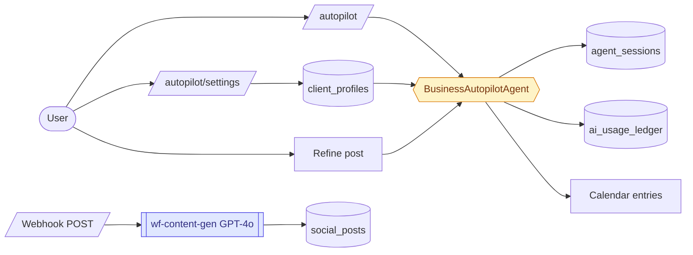

# Content Studio

> Generate on-brand social posts and email campaigns using your business profile — including platform-specific formatting, SEO keywords, and hashtags.

---

## Quick view

---

## What it does (in 30 seconds)

Content Studio generates social media posts and email content using the `BusinessAutopilotAgent`. The user sets up a client profile (industry, tone, platforms, content pillars, keywords) and the agent produces a full week's content calendar: social posts per platform with hashtags and image prompts, plus email campaign drafts with 3 subject line variants and short/long body options. Content is generated in brand voice and can be refined via chat.

---

## Built capabilities

| Capability | Type | What it does | Trigger / cadence |
|---|---|---|---|
| Weekly calendar generation | AI Agent | `BusinessAutopilotAgent.generateCalendar(week)` — produces N social posts + M email drafts based on client profile config | User clicks "Generate" on `/autopilot` |
| Post refinement | AI Agent | `BusinessAutopilotAgent.refinePost(content, feedback)` — edits a specific post or email entry based on user feedback; multi-turn session | User-triggered feedback on a draft |
| Social post generator (standalone) | N8N Webhook | `wf-content-gen.json` — receives `{contentType, topic, platforms, tone, keywords}` webhook; calls OpenAI GPT-4o; saves draft to `social_posts` table | Webhook POST to `draggonnb-generate-content` |
| Email content generator | UI | `/content-generator/email` — standalone email content generation form | User-triggered |
| Social content generator | UI | `/content-generator/social` — standalone social post form | User-triggered |
| Autopilot settings | UI | `/autopilot/settings` — configure client profile (platforms, frequency, tone, keywords, content pillars, email goals, send day) | User-triggered |
| Platform guidelines enforcement | AI Agent | BusinessAutopilotAgent system prompt includes per-platform guidelines (character limits, emoji guidance, CTA style) for LinkedIn, Facebook, Instagram | Built into agent config |

---

## AI Agents

### `BusinessAutopilotAgent`
- **Type:** claude-haiku-4-5-20251001 (default; Sonnet unlocked for scale/platform_admin tiers via `selectModel()`)
- **What it does:** Generates weekly content calendars containing social posts and email campaign drafts. Can also refine individual posts or run freeform chat
- **Input:** `ClientProfile` (business name, industry, tone, platforms, posting frequency, SEO keywords, content pillars, email goals) + week identifier (e.g. "2026-W18")
- **Output:** `AutopilotCalendar { week, theme, notes, entries[] }` — entries are either `AutopilotCalendarEntry` (social) or `AutopilotEmailEntry` (email) with full copy, hashtags, image prompts, subject line variants, CTA, segment suggestions
- **Trigger:** User clicks "Generate" from `/autopilot` page; also supports `refinePost()` and `chat()` methods for iteration
- **Cost guardrail:** Standard `checkCostCeiling()` before every call; `ai_usage_ledger` insert per call; maxTokens 8192 (higher than default — calendar output is large)

---

## N8N workflows

| Workflow file | Purpose | Schedule | Status |
|---|---|---|---|
| `wf-content-gen.json` | Webhook-triggered social post generator using OpenAI GPT-4o; saves draft to `social_posts` table | Webhook (POST) | active |

Note: `wf-content-gen.json` uses **OpenAI GPT-4o** (not Claude). This is a legacy N8N workflow that pre-dates the BusinessAutopilotAgent. The main content generation path for the dashboard uses the Claude-based `BusinessAutopilotAgent`.

---

## Database (key tables)

- `client_profiles`: per-org autopilot configuration (business_name, industry, tone, preferred_platforms, posting_frequency, seo_keywords, content_pillars, brand_voice_prompt, etc.)
- `agent_sessions`: session storage for BusinessAutopilotAgent calls (messages, tokens_used, cost_zar_cents)
- `ai_usage_ledger`: per-call cost tracking (agent_type='business_autopilot')
- `social_posts`: draft social posts saved by N8N content-gen webhook (content, platforms, status)

---

## User flows (the 3 most common)

1. **Generate a week's content:** User visits `/autopilot` → selects target week → clicks "Generate Calendar" → `BusinessAutopilotAgent.generateCalendar()` fires → returns structured JSON with social posts for each platform + email draft(s). User reviews entries, edits copy, downloads or copies to scheduler.

2. **Refine a specific post:** User selects a generated post and clicks "Refine" → enters feedback ("make it more casual, drop the LinkedIn tone") → `BusinessAutopilotAgent.refinePost()` fires with same session ID (multi-turn) → returns revised copy in same JSON structure.

3. **Configure autopilot profile:** User visits `/autopilot/settings` → sets industry, tone, platforms, posting frequency per platform, preferred post times, SEO keywords, content pillars. These values populate the `ClientProfile` object injected into the agent system prompt on every calendar generation.

---

## Integrations

- **External:** Anthropic Claude API (via BaseAgent)
- **External (legacy N8N workflow):** OpenAI GPT-4o via `wf-content-gen.json` webhook
- **Internal:** Shares `client_profiles.brand_voice_prompt` with CRM and Campaign Studio; the brand voice wizard at `/settings/brand-voice` populates this field

---

## Tier gating

Content Studio is available at all tiers that have the `content_studio` module activated. The model used for generation is tier-gated via `selectModel()` — Haiku for core/growth, Sonnet for scale/platform_admin.

---

## What's NOT in this module yet

- One-click "Post to social" from the calendar output — content is generated as copy, but there is no direct posting integration to Facebook/Instagram/LinkedIn from Content Studio (that is Campaign Studio's scope)
- Image generation — the agent produces `image_prompt` text, but no image is generated; user must use their own image tool
- Content calendar visual grid UI — output is a list, not a traditional calendar grid view
- Competitor analysis or trending topics integration

---

## Cross-module ties

- Brand voice (`/settings/brand-voice`) is the shared config that powers Content Studio, Campaign Studio, and CRM Easy view email actions
- Generated email drafts from Content Studio can be manually transferred into Email Hub templates

---

*Source of truth (last verified): 2026-04-27*
*Phase 11 build status: green — BusinessAutopilotAgent, autopilot settings, content generator pages all built*
