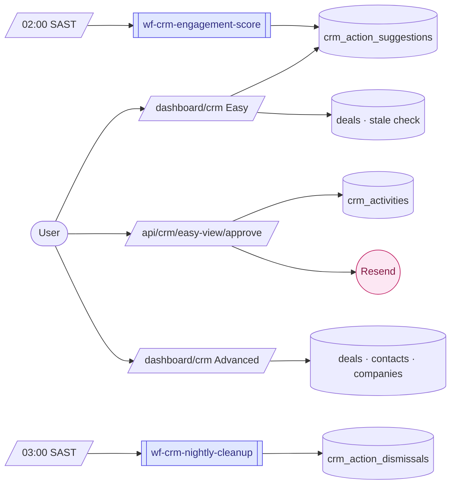

# CRM

> Manage contacts, companies, deals, and pipeline — with AI-assisted action cards or a full pipeline view.

---

## Quick view

---

## What it does (in 30 seconds)

The CRM stores contacts, companies, and deals in a standard pipeline (Lead → Qualified → Proposal → Negotiation → Won/Lost). It has two viewing modes: **Easy view** shows three AI-curated action cards (follow-ups, stale deals, hot leads); **Advanced view** shows the full kanban pipeline and stats. Mode preference persists per user and can be toggled at any time.

---

## Built capabilities

| Capability | Type | What it does | Trigger / cadence |
|---|---|---|---|
| Easy view — follow-ups card | DB Process | Reads `crm_action_suggestions` for contacts scored >= 3 pts; max 5 shown, with "Send email" + "Snooze 1d" per row | On dashboard render |
| Easy view — stale deals card | DB Process | SQL query on `deals` table filtered by per-stage thresholds from `tenant_modules.config.crm.stale_thresholds_days` | On dashboard render |
| Easy view — hot leads card | DB Process | Reads `crm_action_suggestions` for deal entities scored >= 3 pts (value > R5 000 + recent contact) | On dashboard render |
| One-click approve actions | API Route | `POST /api/crm/easy-view/approve` — sends brand-voice email, advances deal stage, writes `crm_activities` row with `source='easy_view'`; 5-second undo toast fires before committing | User-triggered |
| Dismiss action | API Route | `POST /api/crm/easy-view/dismiss` — hides item for 7 days via `crm_action_dismissals` | User-triggered |
| CRM nightly engagement score | N8N Workflow | Scores contacts (manual_followup_flag +15, recent contact +5) and deals (value >R5 000 +8, recent contact +5); upserts results into `crm_action_suggestions` | Nightly 02:00 SAST cron |
| CRM nightly cleanup | N8N Workflow | Deletes expired rows from `entity_drafts` and `crm_action_dismissals` | Nightly 03:00 SAST cron |
| UI mode persistence | API Route | `PATCH /api/crm/ui-mode` — writes `user_profiles.ui_mode` (easy/advanced); checked on every page load | User-triggered |
| Contact CRUD | API Route | `GET/POST /api/crm/contacts`, `GET/PATCH/DELETE /api/crm/contacts/[id]` | User-triggered |
| Company CRUD | API Route | `GET/POST /api/crm/companies`, `GET/PATCH/DELETE /api/crm/companies/[id]` | User-triggered |
| Deal CRUD | API Route | `GET/POST /api/crm/deals`, `GET/PATCH/DELETE /api/crm/deals/[id]` | User-triggered |
| Advanced view pipeline chart | DB Process | Aggregates deal counts and values by stage on page render | On dashboard render |
| Brand voice fallback banner | UI | If `client_profiles.brand_voice_prompt` is null, Easy view shows an in-line banner prompting brand voice setup | On dashboard render |

---

## AI Agents (if any)

No per-render agent calls in CRM. The nightly N8N workflow computes engagement scores using pure SQL logic (no Claude calls in v3.0). This is intentional per UX-05: pages read from cached `crm_action_suggestions`, never fire BaseAgent on render.

The one-click email action uses brand-voice-templated emails (reads `client_profiles.brand_voice_prompt` directly) — not an agent call.

---

## N8N workflows

| Workflow file | Purpose | Schedule | Status |
|---|---|---|---|
| `wf-crm-engagement-score.json` | Scores contacts (follow-up readiness) and deals (hot lead) nightly; upserts into `crm_action_suggestions` for Easy view cards | Nightly 02:00 SAST | inactive (manual import needed) |
| `wf-crm-nightly-cleanup.json` | Deletes expired `entity_drafts` and `crm_action_dismissals`; Telegram alert if > 100 rows deleted | Nightly 03:00 SAST | inactive (manual import needed) |

---

## Database (key tables)

- `contacts`: person records (name, email, company, status, last_contacted_at, manual_followup_flag)
- `companies`: company records linked to contacts
- `deals`: sales pipeline rows (stage, value, probability, contact_id)
- `crm_activities`: audit log of all CRM actions including Easy view actions (source, action_type)
- `crm_action_suggestions`: nightly-scored suggestions (card_type, entity_type, entity_id, score, score_breakdown, refreshed_at)
- `crm_action_dismissals`: per-user dismiss records with expires_at (7 days)
- `entity_drafts`: in-progress form auto-saves with expires_at; cleaned nightly
- `user_profiles`: stores ui_mode preference (easy/advanced) per user

---

## User flows (the 3 most common)

1. **Easy view morning sweep:** User logs in → CRM defaults to Easy view → three cards load from cached `crm_action_suggestions` + stale deal SQL. User clicks "Send email" on a follow-up contact → 5-second undo toast appears → after timeout, brand-voice email sent via Resend, `crm_activities` row written with `source='easy_view'`.

2. **Stale deal triage:** Easy view stale deals card shows a deal stuck in Proposal stage for 14+ days. User clicks "Decide" → modal appears with three options: Engage (sends re-engagement email), Archive (moves to Lost — stale with audit row), Snooze (hides for 7 days).

3. **Advanced view pipeline management:** Manager toggles to Advanced view → sees pipeline chart by stage + recent contacts/deals tables. Creates a new deal (`/crm/deals?action=new`), edits stage directly. Nightly cron scores the deal and it surfaces in Easy view hot leads card for colleagues the next morning.

---

## Integrations

- **Internal:** Resend (email send on one-click actions via brand voice template), `client_profiles` table for brand voice prompt injection
- **Internal:** Campaign Studio — easy view "Send email" shares brand voice infra with Phase 10 brand voice system

---

## Tier gating

CRM module available at all tiers (`module_registry.min_tier = 'core'` based on `tenant_modules` activation). Easy/Advanced toggle is available to all CRM users. Advanced stale threshold configuration (`tenant_modules.config.crm.stale_thresholds_days`) is available but defaults are seeded on org create.

---

## What's NOT in this module yet

- Email open/click tracking events — engagement scoring (v3.0) uses time-based signals only; email_tracking_events table is planned for v3.1
- Bulk contact import (CSV) — contacts are added one at a time via the UI
- Two-way WhatsApp message log in contact timeline
- Sequence enrollment from Easy view (one-click email is a standalone send, not a sequence trigger)

---

## Cross-module ties

- Contacts created in CRM surface as guest records in Accommodation (same org, different module)
- Campaign Studio pulls contact lists from the CRM `contacts` table for email/SMS recipient selection
- Easy view brand voice emails share the same `client_profiles.brand_voice_prompt` field as Campaign Studio drafts

---

*Source of truth (last verified): 2026-04-27*
*Phase 11 build status: green — Easy view + Advanced view + nightly N8N workflows all shipped*
