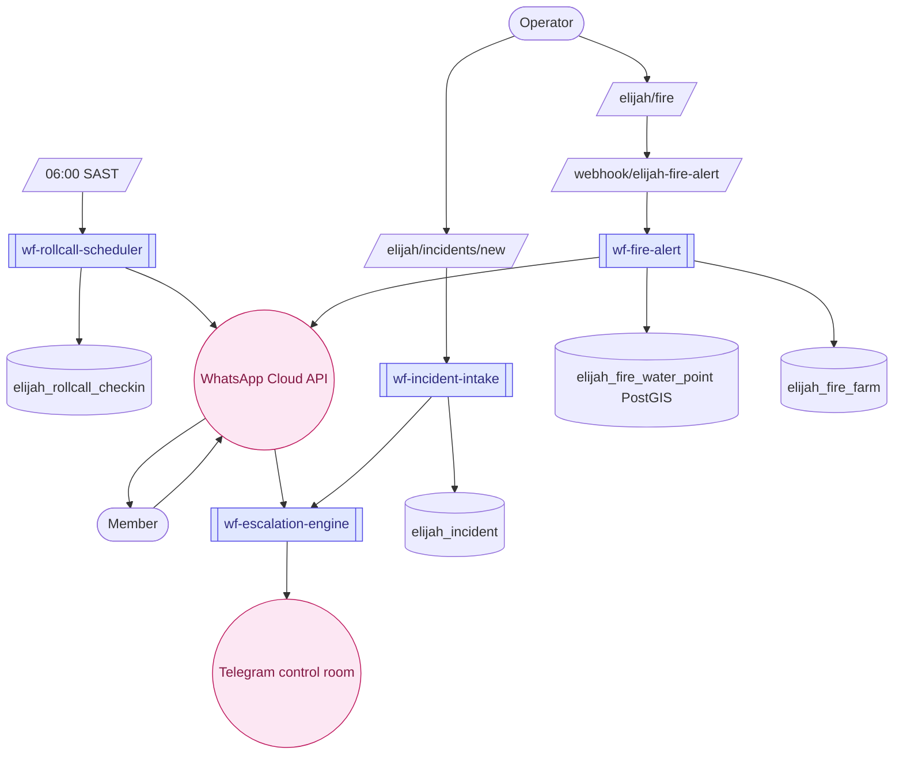

# Elijah Community Safety

> Daily roll call, incident management, fire response coordination, and patrol tracking — purpose-built for residential estates and community safety organisations in South Africa.

---

## Quick view

---

## What it does (in 30 seconds)

Elijah is a community safety operations module. It runs a daily WhatsApp roll call to all registered households, escalates non-responses after a configurable grace period, captures and categorises incidents, coordinates fire response with nearest water point routing, and tracks patrol schedules. Everything is built around section-based organisation (a neighbourhood divided into areas) with household-level granularity.

---

## Built capabilities

| Capability | Type | What it does | Trigger / cadence |
|---|---|---|---|
| Daily roll call dispatch | N8N Workflow | Queries active schedules, loops through households in each section, sends WhatsApp message ("Reply SAFE/HELP/AWAY") via Meta Cloud API, inserts pending `elijah_rollcall_checkin` rows | Daily 06:00 SAST cron (configurable per schedule) |
| Roll call grace period | N8N Workflow | After grace_minutes (configurable per schedule), queries still-pending checkins and triggers escalation engine for each | Within workflow; waits grace period then checks |
| Escalation engine | N8N Workflow | Receives `{ schedule_id, household_id, checkin_id }` from roll call or direct trigger; applies escalation logic (notify section coordinator, alert control room) | Webhook trigger from roll call or incident |
| Fire alert dispatcher | N8N Workflow | On fire_incident webhook: fetches fire details + nearest 3 water points (PostGIS distance query) + farm access codes + responder group leaders; builds WhatsApp alert messages; sends to each group leader; logs dispatch | Webhook `POST /webhook/elijah-fire-alert` |
| Incident intake | N8N Workflow | Processes incident submissions; categorises; routes to appropriate response | Webhook trigger |
| Fire map | UI | `/elijah/fire/map` — interactive map of fire incidents, water points, farm boundaries | On-demand view |
| Fire equipment | UI | `/elijah/fire/equipment` — track firefighting equipment inventory | Manager-triggered |
| Fire farms | UI | `/elijah/fire/farms` — register farms with owner details, access codes, gate GPS coordinates for fire response | Manager-triggered |
| Fire groups | UI | `/elijah/fire/groups` — manage responder groups (group members, roles, contact phones) | Manager-triggered |
| Fire water points | UI | `/elijah/fire/water-points` — register water points (type, capacity, GPS, status) | Manager-triggered |
| Fire alert dashboard | UI | `/elijah/fire` — overview of active fire incidents | Manager-triggered |
| Incidents list | UI | `/elijah/incidents` — list and filter all incidents | Staff/manager-triggered |
| New incident | UI | `/elijah/incidents/new` — log a new incident (type, severity, location, description) | Staff-triggered |
| Incident detail | UI | `/elijah/incidents/[id]` — full incident record with timeline | Staff/manager-triggered |
| Members | UI | `/elijah/members` + `/elijah/members/[id]` — manage community members and their household links | Manager-triggered |
| Patrols | UI | `/elijah/patrols` + `/elijah/patrols/[id]` — schedule and track patrol routes and check-ins | Staff-triggered |
| Roll call dashboard | UI | `/elijah/rollcall` — shows today's roll call results (responded, pending, HELP flags) | Manager view |
| Roll call settings | UI | `/elijah/rollcall/settings` — configure roll call schedules, grace periods, message templates per section | Manager-triggered |
| SOPs | UI | `/elijah/sops` — community safety SOPs | Manager-triggered |
| Settings | UI | `/elijah/settings` — org-level Elijah configuration | Manager-triggered |

---

## AI Agents (if any)

No AI agents in the Elijah module. All workflows are deterministic: scheduled N8N workflows, PostGIS spatial queries for water point proximity, and rule-based escalation logic. There is no Claude API call in any Elijah workflow.

---

## N8N workflows

| Workflow file | Purpose | Schedule | Status |
|---|---|---|---|
| `elijah/workflow-a-rollcall-scheduler.json` | Daily roll call via WhatsApp to all active households per section; waits grace period; escalates pending non-responses | Daily cron (06:00 SAST default, configurable) | inactive (manual import needed) |
| `elijah/workflow-b-incident-intake.json` | Processes incident submissions, categorises, routes to response | Webhook | inactive (manual import needed) |
| `elijah/workflow-c-escalation-engine.json` | Receives escalation triggers from roll call or incidents; notifies section coordinators and control room | Webhook | inactive (manual import needed) |
| `elijah/workflow-d-fire-alert.json` | Fire alert dispatcher — fetches water points + farm access + responder groups; sends WhatsApp alerts; logs dispatch | Webhook `POST /webhook/elijah-fire-alert` | inactive (manual import needed) |

---

## Database (key tables)

Elijah has 33 tables. Key ones:

- `elijah_household`: registered households (name, primary_contact_phone, primary_contact_name, section_id, org_id, is_active)
- `elijah_rollcall_schedule`: roll call schedule definitions (org_id, section_id, scheduled_time, grace_minutes, is_active, message_template, last_run_date)
- `elijah_rollcall_checkin`: per-household check-in records (schedule_id, household_id, org_id, status [pending/safe/help/away], sent_at, responded_at)
- `elijah_member`: community member records (name, phone, role, section)
- `elijah_incident`: incident records (type, severity, description, location, status)
- `elijah_fire_incident`: fire-specific incident records (fire_type, wind_direction, farm_id, linked to elijah_incident)
- `elijah_fire_water_point`: water points with PostGIS geography column (name, type, status, capacity_litres, location)
- `elijah_fire_farm`: farm registry for fire response (name, owner, access_code, gate_gps)
- `elijah_fire_responder_group`: responder groups (name, type, contact_phone)
- `elijah_fire_responder_group_member`: members per group with roles (leader, member)
- `elijah_fire_incident_group_dispatch`: log of which groups were dispatched to which incidents
- `elijah_patrol`: patrol records (route, assigned_to, start_time, end_time)

---

## User flows (the 3 most common)

1. **Daily roll call cycle:** N8N `workflow-a-rollcall-scheduler.json` fires at 06:00 SAST → queries active `elijah_rollcall_schedule` rows → for each section, loops through active households → sends WhatsApp "Reply SAFE/HELP/AWAY" message → inserts `elijah_rollcall_checkin` with status `pending`. After grace period, re-queries pending rows → households still pending are sent to the escalation engine webhook. Manager views today's results at `/elijah/rollcall`.

2. **Fire alert response:** Incident reporter creates a fire incident via dashboard or API → sends webhook `POST /webhook/elijah-fire-alert` with `fire_incident_id`. N8N `workflow-d-fire-alert.json` receives webhook → fetches fire details → runs PostGIS nearest-water-point query (top 3) → fetches farm access codes → fetches responder group leaders with phones → builds structured WhatsApp alert per group (fire type, wind direction, water points, farm gate code) → sends to each leader → logs dispatch to `elijah_fire_incident_group_dispatch`.

3. **Incident logging and escalation:** Staff logs a new incident at `/elijah/incidents/new` → incident is categorised → `workflow-b-incident-intake.json` processes it → routes to `workflow-c-escalation-engine.json` if severity warrants → escalation engine notifies section coordinators. Manager tracks incident at `/elijah/incidents/[id]` through resolution.

---

## Integrations

- **External:** WhatsApp Cloud API (Meta Graph API v18/v21) — daily roll call messages, fire alerts, HELP response escalation
- **External:** Supabase Postgres (PostGIS extension) — spatial queries for nearest water points using `ST_Distance` and `ST_SetSRID`
- **Internal:** Elijah is a standalone module within the DraggonnB platform; shares Supabase database with RLS but has its own `elijah_` prefixed table namespace

---

## Tier gating

Elijah is a standalone module activated in `tenant_modules`. It is not bundled with the standard `crm`, `email`, or `accommodation` modules — it is provisioned separately for community safety organisations.

---

## What's NOT in this module yet

- Inbound WhatsApp response handler — roll call sends messages out but does NOT yet have a webhook to automatically process "SAFE"/"HELP"/"AWAY" replies and update checkin status (manual update or a future inbound webhook)
- Real-time map tracking of patrols (patrol tracking is manual check-in, not GPS live tracking)
- Push notification / in-app alert channel (currently only WhatsApp)
- Integration with municipal emergency services (SAPS, fire brigade) — this is community self-managed

---

## Cross-module ties

- Elijah shares the DraggonnB Supabase project and RLS infrastructure but has no direct data ties to CRM, Accommodation, or Restaurant modules
- Elijah members can be linked to the broader platform `organization_users` if the org uses multiple DraggonnB modules

---

*Source of truth (last verified): 2026-04-27*
*Module registry: elijah, min_tier = starter*
*Phase 11 build status: green — 4 N8N workflows, 33 DB tables, all UI pages built; inbound WhatsApp reply parsing is not yet built*
