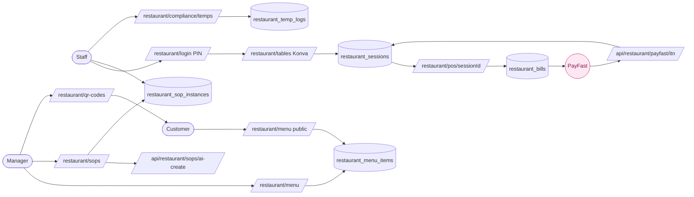

# Restaurant

> Full-service restaurant management: POS, Konva floor plan, SOPs, QR menus, events, and compliance temperature logging.

---

## Quick view

---

## What it does (in 30 seconds)

The Restaurant module covers a complete restaurant operation. Staff use the Konva-based visual floor plan to open sessions per table, add menu items, split bills, link tables, and process PayFast payments. Managers maintain SOPs and shift checklists that can be run as step-by-step block procedures. QR codes route customers to the digital menu. Events are managed separately. Temperature logs support health compliance.

---

## Built capabilities

| Capability | Type | What it does | Trigger / cadence |
|---|---|---|---|
| Visual floor plan | UI | Konva-based canvas at `/restaurant/tables` — drag tables, assign sections, colour-coded by status (available/occupied/pending payment/linked) | User-triggered; updates via table CRUD |
| Table session management | API Route | `POST /api/restaurant/sessions` — opens a table session; `POST /api/restaurant/sessions/[id]/close` — closes session | Staff-triggered |
| Menu management | UI + API | `/restaurant/menu` + `GET/POST /api/restaurant/menu` — manage categories and items with pricing | Manager-triggered |
| POS — add items to bill | UI + API | `/restaurant/pos/[sessionId]` — add/remove menu items to a session bill; `POST /api/restaurant/bills/[id]/items` | Staff-triggered |
| Bill management | UI + API | `/restaurant/bills` + `GET /api/restaurant/bills/[id]` — view and manage open bills | Staff-triggered |
| Split bill | API Route | `POST /api/restaurant/bills/[id]/split` — splits a bill across multiple seats or payment methods | Staff-triggered |
| Void item | API Route | `POST /api/restaurant/bills/[id]/items/[itemId]/void` — voids a bill line item | Manager-triggered |
| PayFast payment | API Route | `POST /api/restaurant/payfast/initiate`, `POST /api/restaurant/payfast/itn` — initiates PayFast payment; handles ITN webhook | Staff-triggered + PayFast webhook |
| Payment link | API Route | `POST /api/restaurant/payment/link` — generates a payment link for the bill | Staff-triggered |
| Table linking | API Route | `POST /api/restaurant/tables/groups` — links multiple tables into a single group for a party | Staff-triggered |
| Table position save | API Route | `POST /api/restaurant/tables/positions` — saves drag-and-drop table positions from Konva canvas | Manager-triggered |
| SOPs — text and block format | UI + API | `/restaurant/sops` — create, publish, and run SOPs in either legacy text format or structured block format (step, checklist, photo, temperature, note, sign-off block types) | Manager-triggered |
| SOP blocks | UI | `BlockBuilder`, `BlockBuilderItem`, `BlockConfigModal` — drag-and-drop block composer for structured SOPs | Manager-triggered |
| Run SOP today | UI + API | `POST /api/restaurant/sops/instances` — creates a `restaurant_sop_instances` row; staff works through blocks at `/restaurant/sops/[instanceId]` | Staff-triggered |
| SOP block response | API Route | `PATCH /api/restaurant/sops/instances/[instanceId]/blocks/[blockId]` — marks a block as completed or skipped | Staff-triggered |
| SOP acknowledgments | DB | `restaurant_sop_acknowledgments` — tracks which staff acknowledged each SOP | Auto on publish |
| Checklist templates | UI + API | `/restaurant/sops` (Templates tab) + `POST /api/restaurant/checklists` — create shift checklists (opening, closing, cleaning, food_prep) | Manager-triggered |
| Run checklist today | UI | Create a checklist instance from a template; tick items off in "Today's Checklists" tab | Staff-triggered |
| AI SOP creation | API Route | `POST /api/restaurant/sops/ai-create` — AI-assisted SOP generation | Manager-triggered |
| SOP OCR upload | API Route | `POST /api/restaurant/sops/ocr` — uploads an image/PDF of an existing SOP; OCR extraction | Manager-triggered |
| SOP upload | API Route | `POST /api/restaurant/sops/upload` — file upload for SOP documents | Manager-triggered |
| QR codes | UI | `/restaurant/qr-codes` — generates QR codes that link to the digital menu | Manager-triggered |
| Digital menu (QR) | UI | `/restaurant/menu` — public-facing menu rendered from `restaurant_menu_items` table | Customer (via QR scan) |
| Staff management | UI + API | `/restaurant/staff` + `GET/POST /api/restaurant/staff` — manage staff records; `GET /api/restaurant/staff/public` — public staff lookup (for POS PIN auth) | Manager-triggered |
| PIN authentication | API Route | `POST /api/restaurant/auth/pin` — staff PIN login for POS; session-based | Staff-triggered |
| Reservations | UI + API | `/restaurant/reservations` + `POST /api/restaurant/reservations` — manage table reservations | Manager or customer-triggered |
| Events | UI | `/restaurant/events` — manage restaurant events (private bookings, functions) | Manager-triggered |
| Compliance temperature log | UI + API | `/restaurant/compliance/temps` + `POST /api/restaurant/temp-log` — log fridge/freezer temperatures for health compliance | Staff-triggered |
| Restaurant settings | API Route | `GET/POST /api/restaurant/settings` — restaurant-level config | Manager-triggered |
| Dashboard | UI | `/restaurant/dashboard` — overview of today's sessions, covers, revenue | Manager view |
| POS bill view | UI | `/restaurant/pos/[sessionId]/bill` — bill summary view from POS | Staff-triggered |
| Login (restaurant) | UI | `/restaurant/login` — dedicated restaurant login separate from main platform auth | Staff-triggered |

---

## AI Agents (if any)

No real-time AI agents run in the restaurant POS or floor plan flow. AI-assisted SOP creation is available via `POST /api/restaurant/sops/ai-create` (generates SOP text from a description) and OCR upload at `/api/restaurant/sops/ocr` (extracts text from uploaded images/PDFs). These are user-triggered utilities, not background agents.

---

## N8N workflows

No restaurant-specific N8N workflows in `n8n/`. Restaurant operations are handled entirely through the web app and API routes. The general queue processor (`wf-queue.json`) may be used for message queuing but is not restaurant-specific.

---

## Database (key tables)

- `restaurant_sessions`: table sessions (table_id, status, opened_at, closed_at, total_covers)
- `restaurant_bills`: bill per session (session_id, status, total_zar)
- `restaurant_bill_items`: line items on a bill (bill_id, menu_item_id, quantity, price)
- `restaurant_menu_items`: menu items (name, category, price, is_available)
- `restaurant_tables`: table definitions (number, section, capacity, shape, position_x, position_y)
- `restaurant_floor_plans`: floor plan configs (layout data for Konva canvas)
- `restaurant_sops`: SOP records (title, category, content, sop_format, visible_to_roles, is_published)
- `restaurant_sop_blocks`: blocks within a structured SOP (sop_id, block_type, label, sort_order, is_required)
- `restaurant_sop_instances`: daily SOP runs (sop_id, shift_date, status, started_by)
- `restaurant_sop_block_responses`: per-block completion records for an instance
- `restaurant_sop_acknowledgments`: staff acknowledgment log
- `restaurant_checklist_templates`: reusable checklist definitions (name, type, items[])
- `restaurant_checklist_instances`: daily checklist runs (template_id, shift_date, status)
- `restaurant_checklist_items`: per-item completion records
- `restaurant_staff`: staff records (name, role, pin_hash)
- `restaurant_reservations`: reservation records
- `restaurant_temp_logs`: temperature readings (location, temperature, logged_by, logged_at)

---

## User flows (the 3 most common)

1. **Table service (POS flow):** Manager opens floor plan at `/restaurant/tables` → staff sees colour-coded table status → staff clicks a table → opens session modal → session created → staff goes to POS `/restaurant/pos/[sessionId]` → adds menu items → prints bill → customer pays via PayFast link or cash → session closed → table returns to available.

2. **SOP procedure run:** Manager creates a block-format SOP in `/restaurant/sops` (e.g. "Kitchen Opening Procedure" with 12 blocks: checklist, temperature, photo, sign-off) → publishes it → clicks "Run Today" → creates a `restaurant_sop_instances` row → staff goes to `/restaurant/sops/[instanceId]` → works through blocks sequentially, ticking off each one → SOP shows as completed for that shift.

3. **QR menu (customer facing):** Manager goes to `/restaurant/qr-codes` → generates QR code for a table or the restaurant → customer scans QR → sees `/restaurant/menu` (public, no login required) → digital menu rendered from `restaurant_menu_items` table.

---

## Integrations

- **External:** PayFast (bill payments via `/api/restaurant/payfast/*` routes and ITN webhook)
- **Internal:** Restaurant is its own route group `app/(restaurant)/` separate from the main `app/(dashboard)/` — it has its own login and session model

---

## Tier gating

Restaurant module requires the `restaurant` module activated in `tenant_modules`. The module is accessed via a separate subdomain or route path and has its own PIN-based staff authentication separate from the main Supabase Auth flow.

---

## What's NOT in this module yet

- Kitchen Display System (KDS) — orders are taken at POS but there is no live kitchen screen
- Loyalty / membership program
- Online ordering / delivery integration
- Accounting integration (no Xero/Pastel/Sage sync)
- Real-time reservation widget for customers (reservations are staff-entered, not self-service)
- Tip/gratuity tracking

---

## Cross-module ties

- Restaurant events (`/restaurant/events`) are a distinct sub-module; the Events page exists but is managed separately from accommodation events
- Restaurant is entirely within the DraggonnB platform but operates with its own route group, auth model, and primarily non-shared tables (prefixed `restaurant_`)

---

*Source of truth (last verified): 2026-04-27*
*Module registry: restaurant, min_tier = starter*
*Phase 11 build status: green for core POS, SOPs, floor plan; SOP AI creation and OCR are partial*
